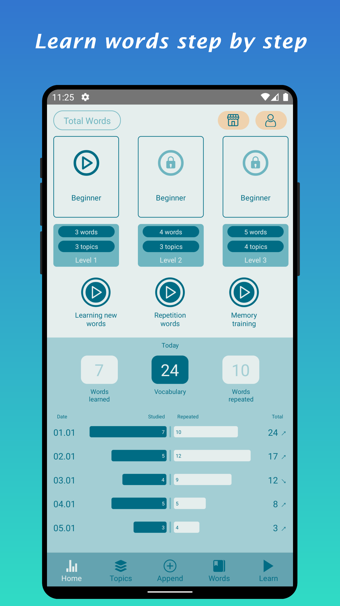
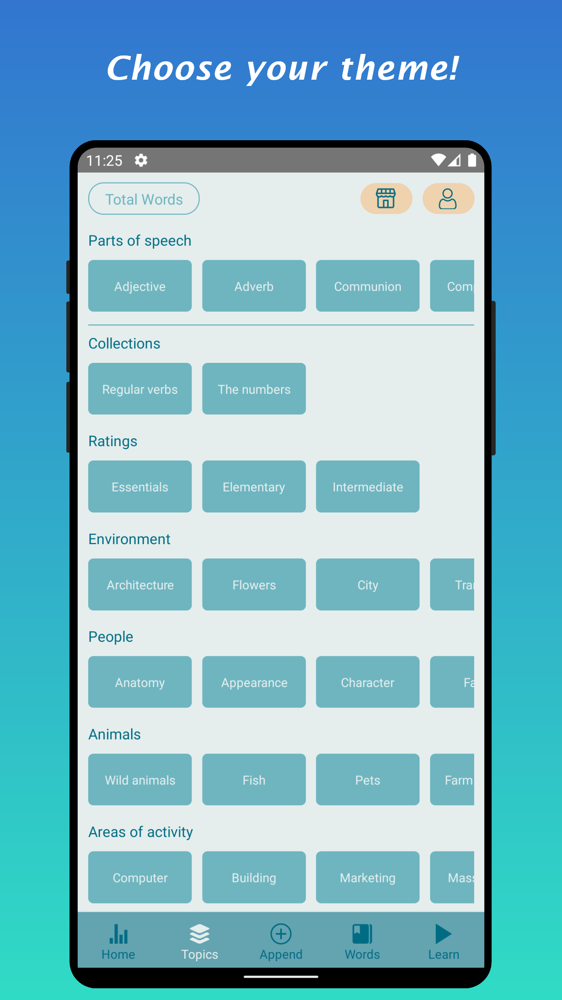
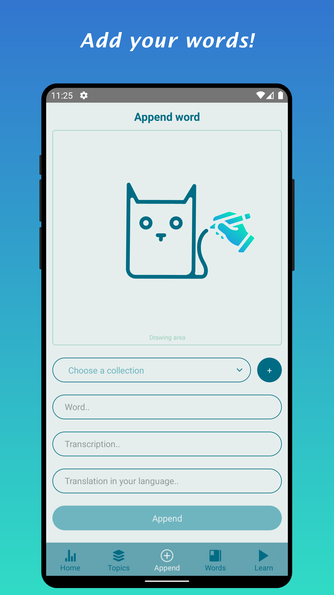
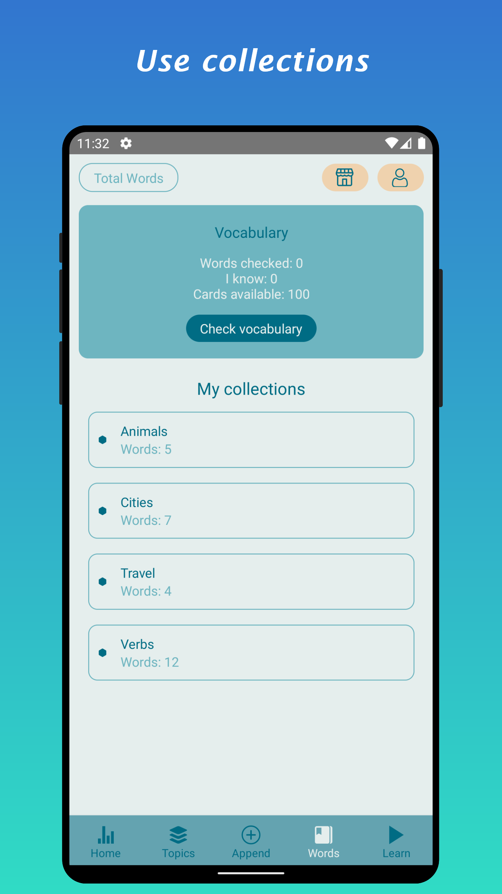
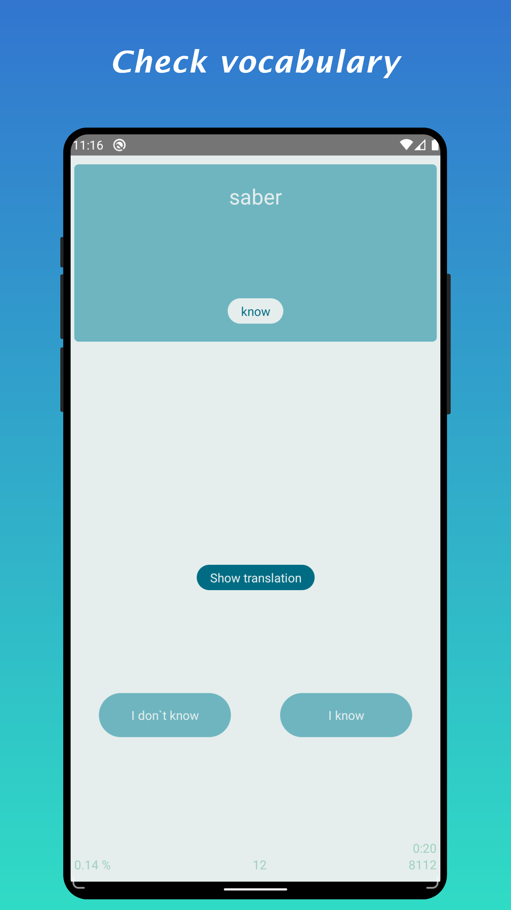
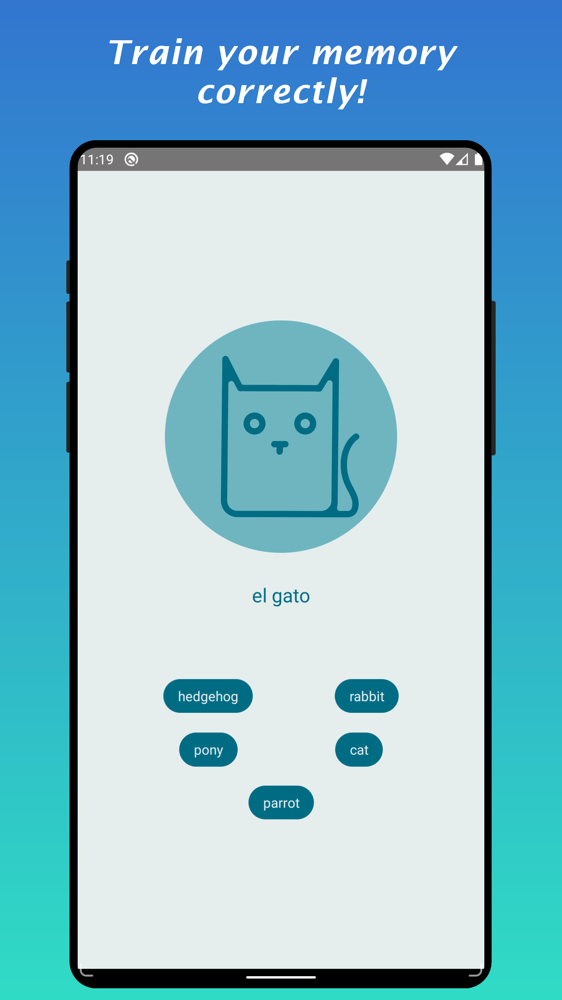

# TotalWords

TotalWords - application for learning foreign words with cards.
Vocabulary checker. Creating your own word sets.

[Available on Google Play.](https://play.google.com/store/apps/details?id=com.multipps.totalwords)

## Features

- Learning words with cards.
- Creating your own word sets.
- When creating a word card, you can draw sketches for better memorization.
- Words are divided into levels by popularity.
- Groups of words by parts of speech and topics.
- Vocabulary counting.
- Study statistics.
- Dark theme.

## Languages

Native languages:

- Russian
- English
- Spanish
- French
- German

Target languages ​​for learning words:

- Russian
- English
- Spanish
- French
- German

## Platforms and technology stack

OS: Android

Powered by JavaScript using React Native.

## Feedback

Please submit questions, suggestions and problems in the Issues section.
