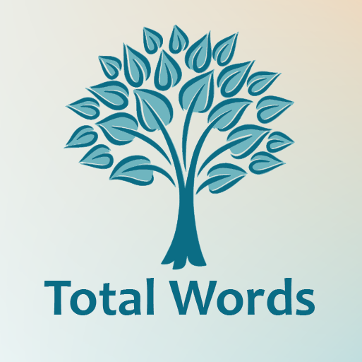
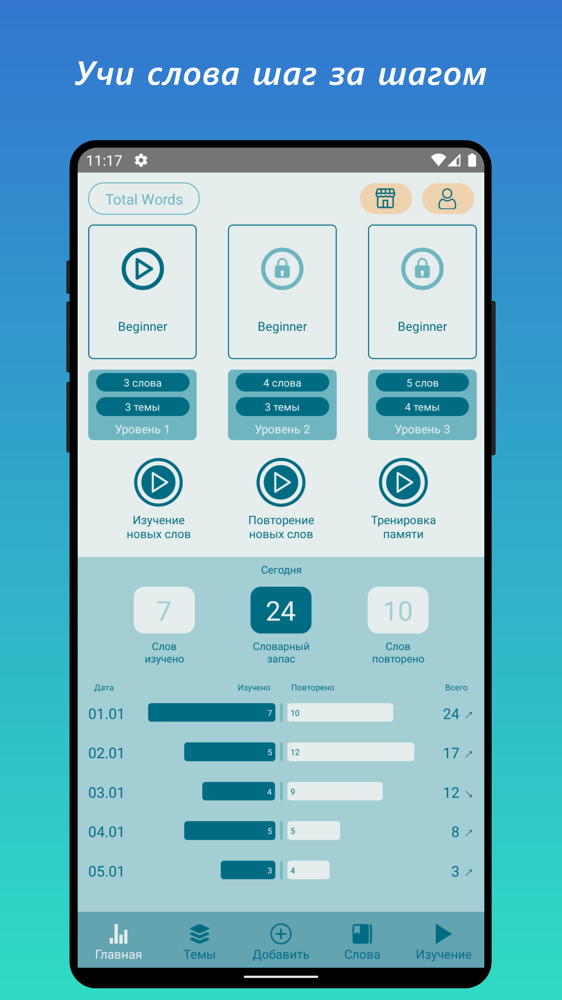
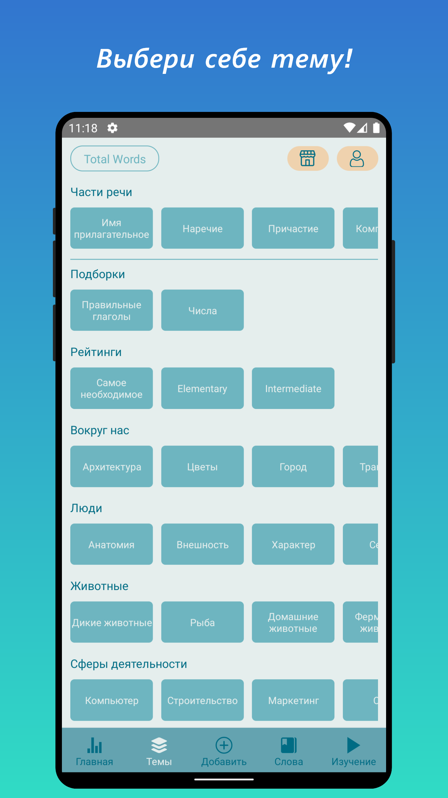
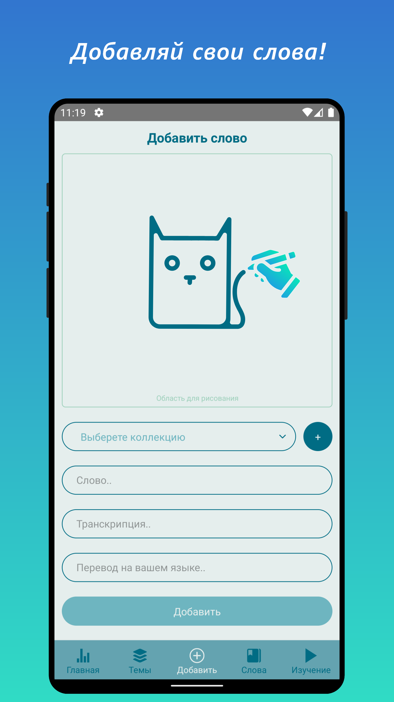
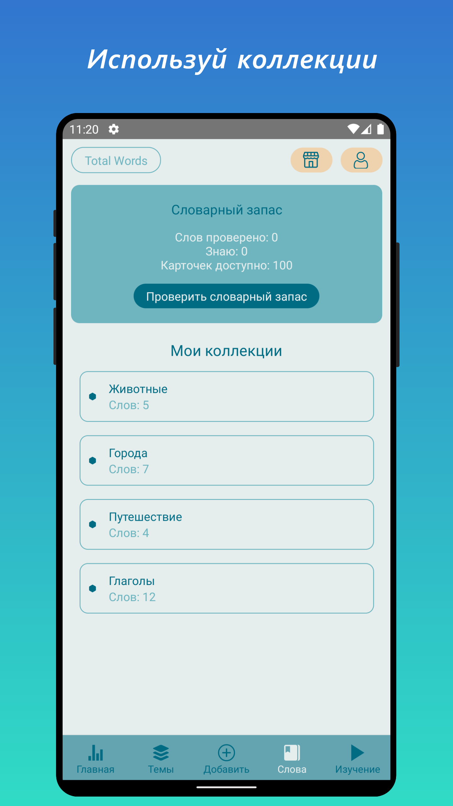
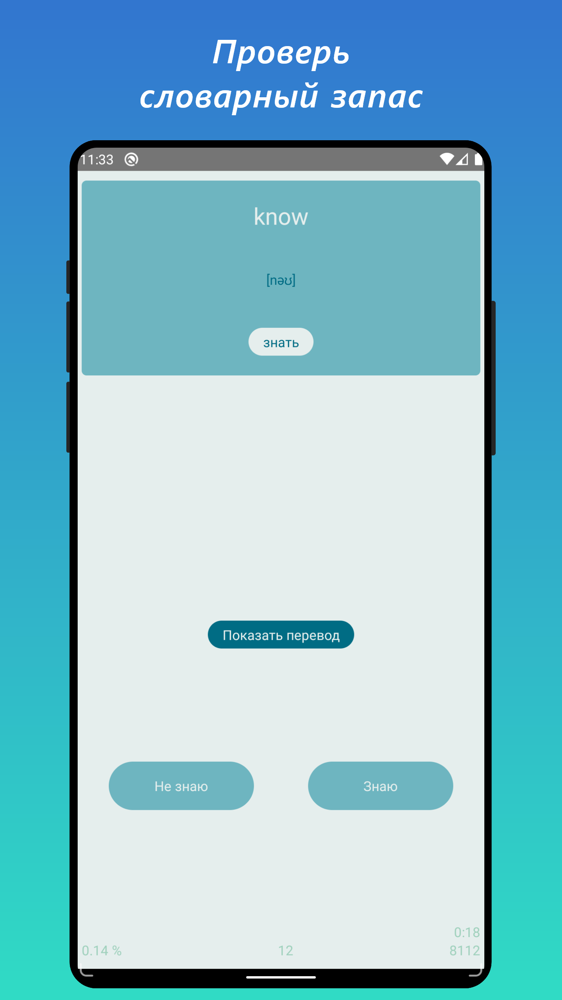
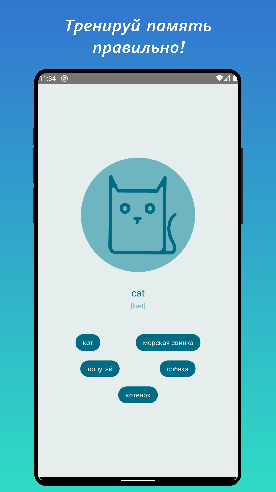

# TotalWords

TotalWords - приложение для изучения иностранных слов с помощью карточек.
Проверка словарного запаса. Создание собственных наборов слов.

[Доступно в Google Play.](https://play.google.com/store/apps/details?id=com.multipps.totalwords)

## Возможности

- Изучение слов спомощью карточек.
- Создание собственных наборов слов.
- При создании карточки слова, можно рисовать наброски для лучшго запоминания.
- Слова разбиты на уровни по частоте встречаемости.
- Группы слов по частям речи и тематикам.
- Подсчёт словарного запаса.
- Статистика изучения.
- Тёмная тема.

## Языки

Языки носителя:

- Русский
- Английский
- Испанский
- Французский
- Немецкий

Целевые языки изучения слов:

- Русский
- Английский
- Испанский
- Французкий
- Немецкий

## Платформы и технологический стек

ОС: Android

Создано на JavaScript с использованием React Native.

## Обратная связь

Вопросы, предложения и сообщения о проблемах предлагайте в разделе Issues.
